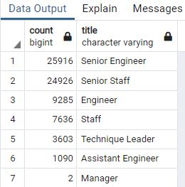
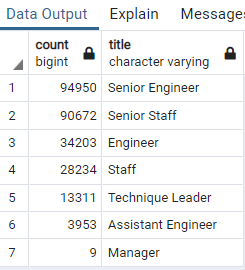
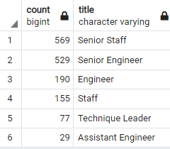
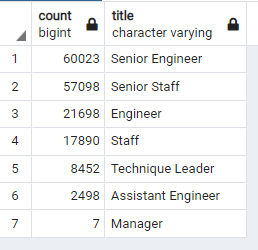

# pewlett-hackard-analysis

## Overview

### Purpose

The purpose of this analysis is to aggregate data necessary to prepare for the change in labor based on age/retirement eligibility of current employees.  This analysis also looks to identify employees near retirement age with whom it will be mutually beneficial with the company to move them into a mentorship program, so that they can pass along skills and knowledge prior to reaching retirement age.

## Results

* A total of 72,458 employees are at or near retirement age, leaving the company at risk of a signficant loss of talent
* From that totals, 25,916 are Senior Engineers and 24,926 are Senior Staff, indicating that 50,842 of those leaving are among the most experienced and valuable employees with the firm.  The full total potential retirees by title are in the image below.  The file with all of the employee info can be found here: [List of Retirees](Data/unique_titles.csv)

* As can be seen in the previous image, the data indicate that 9,285 people at the Engineer level and 1,090 people at the Assistant Engineer level.  This would suggest that these individuals have had a notable lack of career progression for not having achieved a senior level title by the end of their careers.  Both the potential for a large number of senior-ranked individuals to be retiring soon and a lack of progression for others indicate that the company will benefit greatly from a mentorship program.
* Looking at employees who are farther from the ends of their careers and likely to continue with the company, there is some hope to be able to find mentors for younger employees to ensure that company knowledge is retained in the list of employees whose birthdays take place in 1965: [Potential Mentors](Data/mentorship_eligibility.csv)

## Summary

If every employee eligible for retirement were to decide to retire today, a simple query to count the number of unique titles shows us that there would be a total of 72,458 vacant positions immediately in need of replacement.  Following up with a query to count the number of total positions occupied, it is apparent that the soon-to-retire employees comprise a significantly portion of the total current employees.  Senior Engineer departures will account for the loss of 27.3% of the total Senior Engineer workforce and Senior Staff departures will be 27.5%.  Even among the remaining workers, it appears that close-to-retirement individuals make up approximately 25% or more of the total workforce.  The following table shows the total staff by title:

Running a query to determine the total number of potential mentors born in 1965 counted by title shows that there is a fair number of eligible employees who could serve as mentors:

However, it is highly unlikely to establish an effective mentorship program with only these individuals as there would require approximately a 100 to 1 ratio of mentees to mentors.  As such, it is worthwhile to run a query to pull the total count by title of staff who are nearing retirement age who were born bewteen 1956 and 1965: 

These numbers make it clear that there are plenty of potential mentors who likely have enough experience.  However, it is also apparent that this constitutes the remainder of the workforce that is present in the provided datasets and the company does not appear to have anyone employeed who was born after 1965.  Assuming the data sets accurately reflect the company, the best course of action would be to begin an aggressive hiring campaign at all ages and experience levels to ensure that the company will be able to persevere beyond the next 10 years.